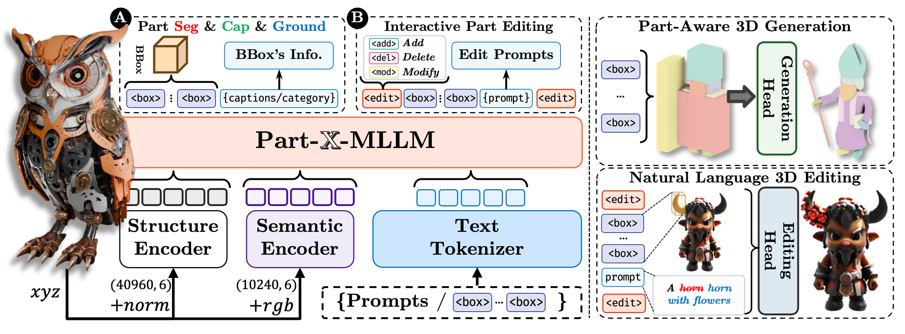

# Part-X-MLLM: Part-aware 3D Multimodal Large Language Model

> Paper: [](https://arxiv.org/abs/2511.13647), Project Leader: [Junliang Ye](https://jamesyjl.github.io/)



## Abstract
We introduce Part-X-MLLM, a native 3D multimodal large language model that unifies diverse 3D tasks by formulating them as programs in a structured, executable grammar. Given an RGB point cloud and a natural language prompt, our model autoregressively generates a single, coherent token sequence encoding part-level bounding boxes, semantic descriptions, and edit commands. This structured output serves as a versatile interface to drive downstream geometry-aware modules for part-based generation and editing. By decoupling the symbolic planning from the geometric synthesis, our approach allows any compatible geometry engine to be controlled through a single, language-native frontend. We pre-train a dual-encoder architecture to disentangle structure from semantics and instruction-tune the model on a large-scale, part-centric dataset. Experiments demonstrate that our model excels at producing high-quality, structured plans, enabling state-of-the-art performance in grounded Q&A, compositional generation, and localized editing through one unified interface.

## Citation

```bibtex
@misc{wang2025partxmllmpartaware3dmultimodal,
      title={Part-X-MLLM: Part-aware 3D Multimodal Large Language Model}, 
      author={Chunshi Wang and Junliang Ye and Yunhan Yang and Yang Li and Zizhuo Lin and Jun Zhu and Zhuo Chen and Yawei Luo and Chunchao Guo},
      year={2025},
      eprint={2511.13647},
      archivePrefix={arXiv},
      primaryClass={cs.CV},
      url={https://arxiv.org/abs/2511.13647}, 
}
```
